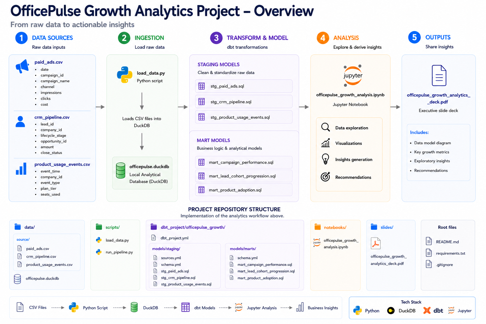
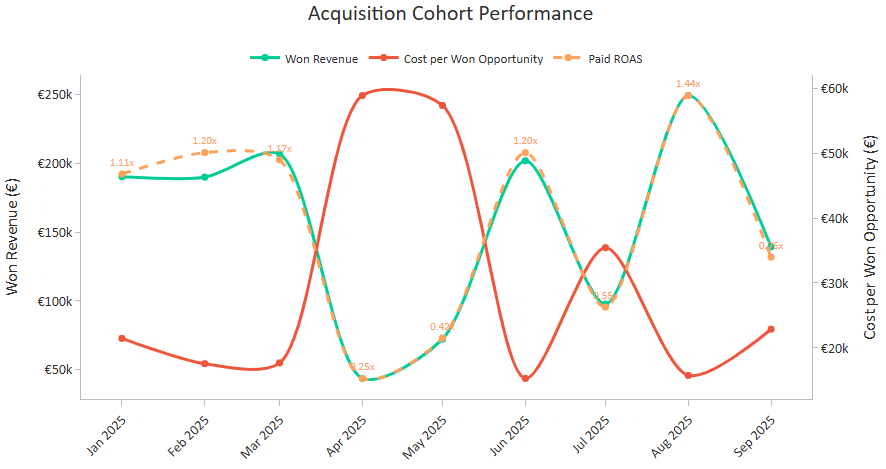
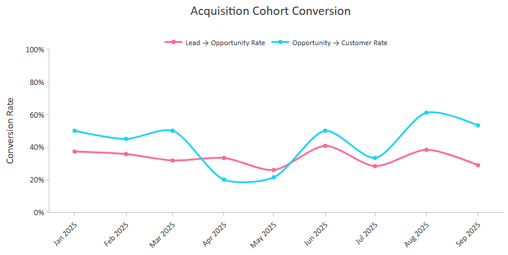
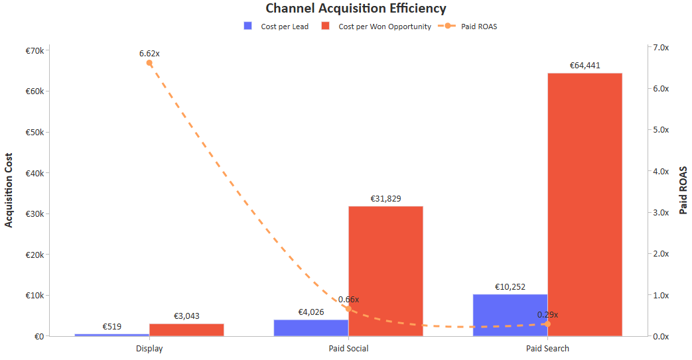
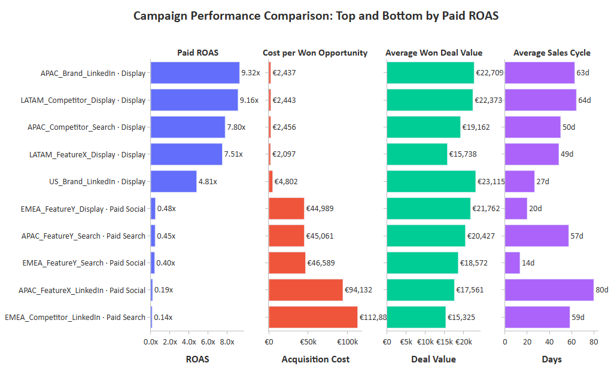
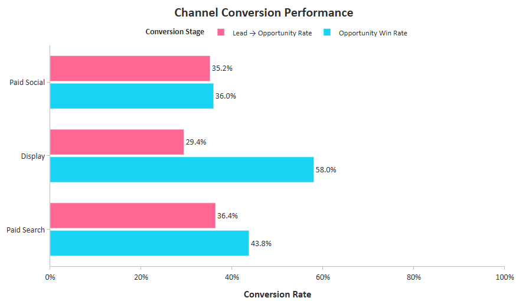
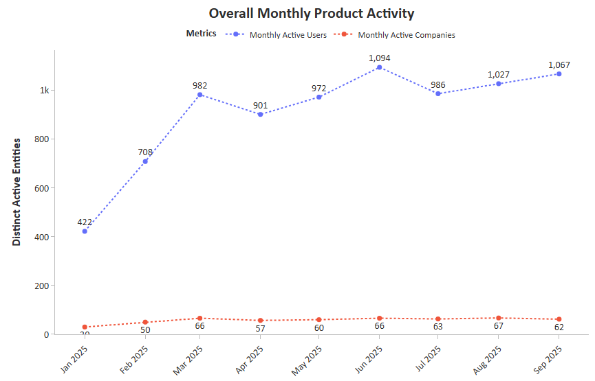
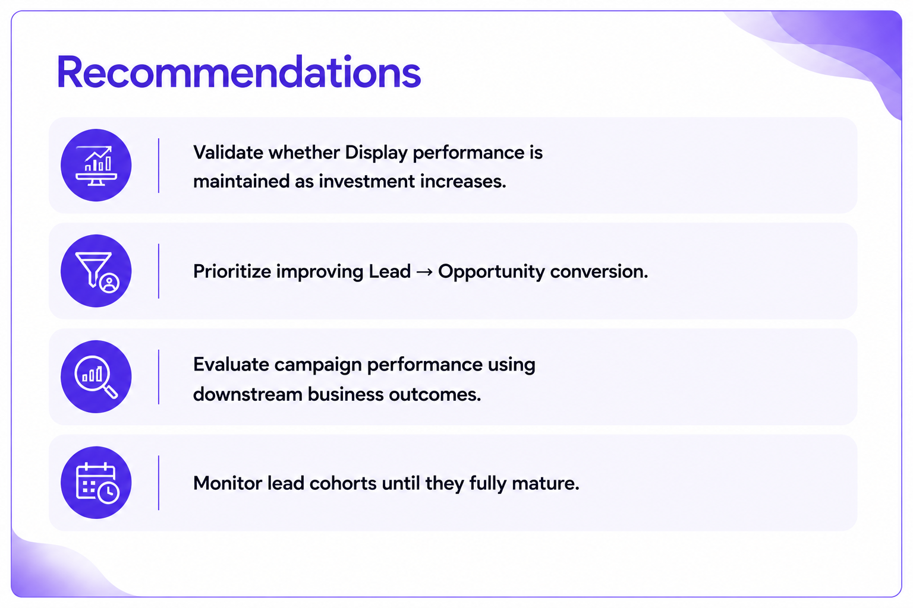
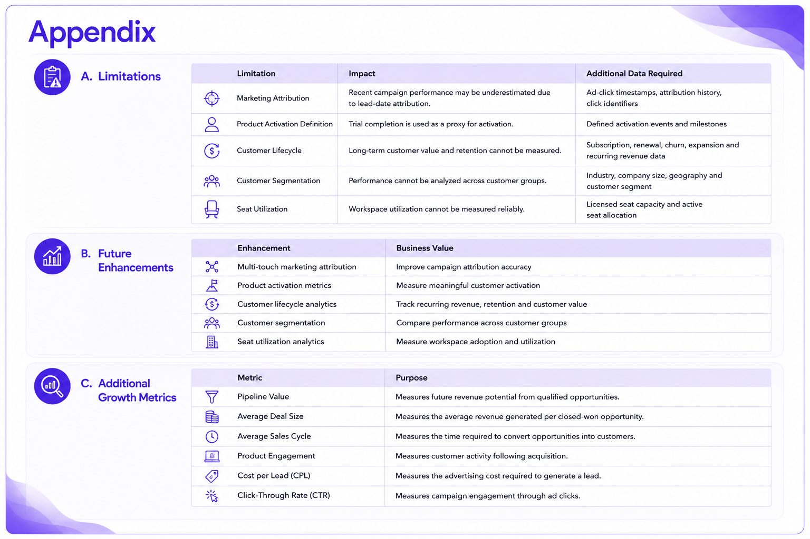

   
 

## Project Resources

📘 [Detailed Analysis Notebook](https://nbviewer.org/github/Emmanuel-Nti/OfficePulse_Growth_Analytics_Project/blob/master/officepulse/notebooks/officepulse_growth_analysis.ipynb?v=2) &nbsp;&nbsp;&nbsp; | &nbsp;&nbsp;&nbsp; ✴️ [Interactive dbt Documentation](https://growth-analytics-dbt-docs.netlify.app/#!/overview)

## Software and Tools

   

## 5 Key Growth Metrics

-informational?style=flat&color=2bbc8a)    

## 📊 Insights
💡 Marketing investment remained relatively stable across acquisition cohorts, providing a stable baseline for evaluating downstream performance. Despite this, Won Revenue and Paid ROAS varied considerably, while Cost per Won Opportunity peaked in April and May when ROAS was lowest and declined in higher-ROAS cohorts, highlighting substantial differences in acquisition efficiency.
  

   
 

💡 Opportunity Win Rate exhibited a similar pattern, suggesting that cohorts with stronger opportunity conversion generally generated higher won revenue and marketing efficiency.

   
 

💡 Display consistently achieved the strongest acquisition efficiency, outperforming Paid Search and Paid Social.

   
 

 
💡 Display's strong channel performance was supported by consistently high-performing campaigns.

   
 

 
💡 Lead-to-opportunity conversion emerged as the primary bottleneck across acquisition channels.

   
 

 
💡 Monthly active users increased overall, while active companies remained relatively stable throughout the reporting period.

   

 

## 🎯 Recommendations, Limitations, and Future Enhancements

 

   

  

   

