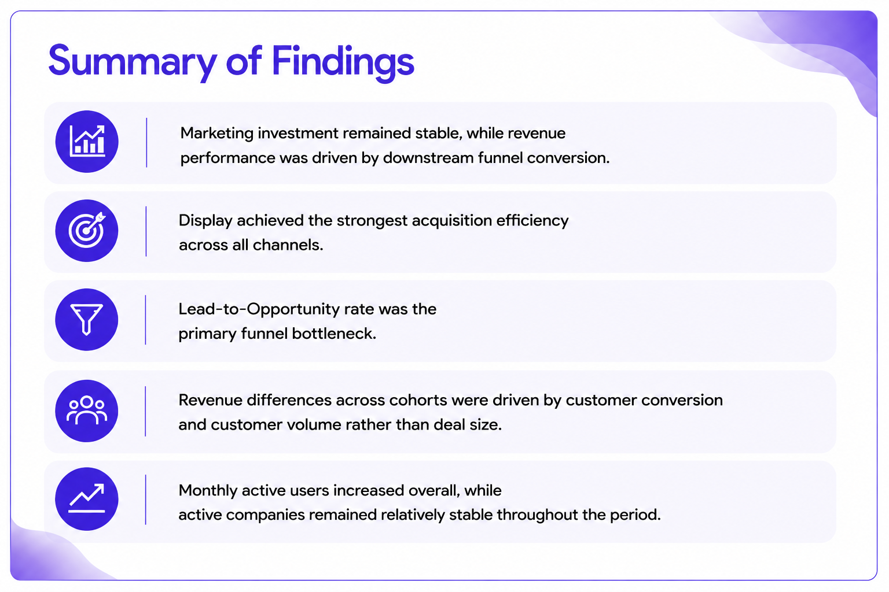

# dbt Data Transformation & Growth Analytics Project
 
End-to-end Growth Analytics project using Python, DuckDB and dbt to load and transform raw data into analytical marts, define key growth metrics, and generate insights across acquisition, conversion, revenue, lead cohorts and product engagement.

   
 

 ## [Detailed Project Notebook Link](https://nbviewer.org/github/Emmanuel-Nti/OfficePulse_Growth_Analytics_Project/blob/master/officepulse/notebooks/officepulse_growth_analysis.ipynb) 
 
  - **Interactive dbt documentation:** [https://growth-analytics-dbt-docs.netlify.app/#!/overview](https://growth-analytics-dbt-docs.netlify.app/#!/overview)

## 5 Key Growth Metrics (Based on the Data)
 - Paid Roas (Cohort Roas), Cost per Won Opportunity, Lead-to-Opportunity Rate, Opportunity Win Rate, Won Revenue

## Insights
  

   
 

 
💡 Marketing investment remained relatively stable across acquisition cohorts, providing a stable baseline for evaluating differences in downstream performance. Despite this, won revenue and Paid ROAS varied considerably across cohorts.

   
 

 
💡 Opportunity Win Rate exhibited a similar pattern, suggesting that cohorts with stronger opportunity conversion generally generated higher won revenue and marketing efficiency.

   
 

 
 💡 Display consistently achieved the strongest acquisition efficiency, outperforming Paid Search and Paid Social.

   
 

 
 💡 Display's strong channel performance was supported by consistently high-performing campaigns.

   
 

 
 💡 Lead-to-Opportunity conversion emerged as the primary bottleneck across acquisition channels.

   

 💡 Monthly active users increased overall, while active companies remained relatively stable throughout the reporting period.

## Summary of Findings, Recommendations, and Limitations

   

 

   

  

   

#### Software and Tools

   
